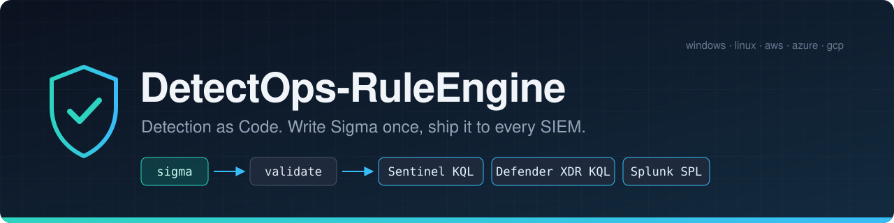
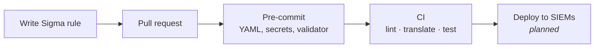

<p align="center">
  
</p>

<p align="center">
  <a href="LICENSE"></a>
  
  
  
  <a href="CONTRIBUTING.md"></a>
</p>

<p align="center">
  <a href="#quick-start">Quick start</a> ·
  <a href="#how-it-works">How it works</a> ·
  <a href="#coverage-by-platform">Coverage</a> ·
  <a href="#repository-layout">Layout</a> ·
  <a href="#rule-library">Rules</a> ·
  <a href="CONTRIBUTING.md">Contributing</a>
</p>

---

**DetectOps-RuleEngine** is an open-source Detection as Code framework. You write a detection
once in [Sigma](https://sigmahq.io/), review it like any other code change, check it
automatically, and translate it into the query language of each SIEM:

- **Microsoft Sentinel** (KQL)
- **Microsoft Defender XDR** (KQL)
- **Splunk** (SPL)

Rules are plain YAML files in Git. Each one is versioned and reviewed, and must pass 17
automated checks before it can be merged.

## Why

- **One rule, many SIEMs.** No more maintaining the same logic by hand in three query languages.
- **A contract, not guesswork.** [`config/logsource_contract.yml`](config/logsource_contract.yml)
  pins which log sources and fields a rule may use, so every rule converts cleanly to every target.
- **Mistakes caught before review.** The validator and pre-commit hooks catch broken YAML, bad
  ATT&CK tags, unknown fields and leaked secrets on your machine, before CI.
- **Generated queries are committed.** Translations live in `platform-translations/` and CI
  fails if they drift from the rules, so the diff shows exactly what will run.

## How it works



1. **Pull request.** Every rule change goes through a pull request and review.
2. **Pre-commit.** Hooks check YAML, whitespace, private keys and secrets
   ([gitleaks](https://github.com/gitleaks/gitleaks)), then run the rule validator.
3. **CI.** The pipeline lints the rules with the same validator, translates them to KQL and
   SPL, checks the committed translations are up to date, and runs the tests.
4. **Deploy.** Automated deployment to each SIEM is on the roadmap.

## Quick start

You need **Python 3.12** and **Git**.

```bash
git clone https://github.com/Garyson26/DetectOps-RuleEngine.git
cd DetectOps-RuleEngine

python3.12 -m venv .venv
. .venv/bin/activate              # Windows: .venv\Scripts\activate
pip install -r requirements-validate.txt
pre-commit install                # run the hooks on every commit
```

Validate every rule:

```bash
python scripts/validate_rules.py --rules sigma --contract config/logsource_contract.yml
```

| Option | Description |
|---|---|
| `--rules` | Root folder of the Sigma rules |
| `--contract` | Path to the log source contract |
| `--junit <path>` | Also write a JUnit XML report (for example `reports/validation.xml`) |

Exit codes: `0` all rules passed · `1` one or more rules failed · `2` usage or config error.
Each failure is printed as `<path>: <CHECK_ID>: <message>`, for example:

```
sigma/aws/aws_cloudtrail_example.yml: V004: level 'low' not in allowed levels: critical, high, medium
```

The checks (V001 to V017) are listed in [CONTRIBUTING.md](CONTRIBUTING.md#validator-checks).

> [!NOTE]
> Check V017 runs `sigma check`, which downloads MITRE ATT&CK and D3FEND data on first run
> (cached in `~/.cache/pysigma`). It needs internet access the first time.

### Run the tests and hooks

```bash
pytest -q tests/test_validate_rules.py
pre-commit run --all-files
```

Tests that need ATT&CK data are skipped when it can't be downloaded or found in the cache.

## Coverage by platform

| Platform | Rules | Log sources in the contract | Translates to |
|---|:---:|---|---|
| 🪟 **Windows** | **2** | process creation, network connection, file event, registry set, image load, Security event log | Sentinel · Defender XDR · Splunk |
| 🐧 **Linux** | **2** | process creation, file event, network connection, auth (syslog) | Sentinel · Defender XDR · Splunk |
| ☁️ **AWS** | **2** | CloudTrail | Sentinel · Splunk |
| 🔷 **Azure** | **2** | Activity logs, sign-in logs, Entra ID audit logs | Sentinel · Splunk |
| 🌐 **GCP** | **2** | Cloud Audit Logs | Sentinel · Splunk |
| | **10** | **15 log sources** | |

Not every log source converts to every SIEM; the contract's `targets` field for each log
source says which ones it does. To count the rules yourself:
`find sigma -name '*.yml' | cut -d/ -f2 | sort | uniq -c`

## Rule library

| Platform | Rule | Level | ATT&CK |
|---|---|---|---|
| Windows | [PowerShell started with encoded command](sigma/windows/win_process_creation_powershell_encoded_command.yml) | medium | T1059.001 |
| Windows | [Kerberos service ticket with RC4 (Kerberoasting)](sigma/windows/win_security_kerberoasting_rc4_service_ticket.yml) | medium | T1558.003 |
| Linux | [Download piped directly to shell](sigma/linux/lnx_process_creation_download_piped_to_shell.yml) | medium | T1059.004, T1105 |
| Linux | [File created in cron directory](sigma/linux/lnx_file_event_cron_file_created.yml) | medium | T1053.003 |
| AWS | [CloudTrail logging stopped or trail deleted](sigma/aws/aws_cloudtrail_trail_logging_stopped.yml) | high | T1685.002 |
| AWS | [Root account console login](sigma/aws/aws_cloudtrail_root_console_login.yml) | high | T1078.004 |
| Azure | [Diagnostic setting deleted](sigma/azure/az_activity_diagnostic_setting_deleted.yml) | high | T1685.002 |
| Azure | [Member added to privileged Entra ID role](sigma/azure/az_audit_member_added_to_privileged_role.yml) | high | T1098.003 |
| GCP | [Logging sink deleted](sigma/gcp/gcp_audit_logging_sink_deleted.yml) | high | T1685.002 |
| GCP | [Service account key created](sigma/gcp/gcp_audit_service_account_key_created.yml) | medium | T1098.001 |

## Repository layout

```text
DetectOps-RuleEngine/
│
├── sigma/                         ✍️  Detection rules: one Sigma rule per .yml file
│   ├── windows/
│   ├── linux/
│   ├── aws/
│   ├── azure/
│   └── gcp/
│
├── config/                        📜  Rules of the road
│   ├── logsource_contract.yml         allowed log sources, fields, levels and SIEM targets
│   └── sigma_validation.yml           settings for `sigma check` (check V017)
│
├── templates/
│   └── rule_template.yml          🧩  commented example rule; start here
│
├── scripts/
│   └── validate_rules.py          ✅  rule validator (checks V001 to V017)
│
├── pipelines/                     🔀  pySigma field mappings per SIEM
│
├── platform-translations/         ⚙️  generated KQL and SPL; committed, never edited by hand
│   ├── sentinel-kql/
│   ├── defender-xdr-kql/
│   └── splunk-spl/
│
├── tests/                         🧪  pytest suite, fixtures and sample logs
│
└── reports/                       📊  generated reports (git-ignored)
```

| You want to… | Go to |
|---|---|
| Write a new detection | [`templates/rule_template.yml`](templates/rule_template.yml) → `sigma/<platform>/` |
| Check which fields a log source allows | [`config/logsource_contract.yml`](config/logsource_contract.yml) |
| See the query that will run in your SIEM | `platform-translations/<siem>/<platform>/` |
| Understand a validator failure | [Validator checks](CONTRIBUTING.md#validator-checks) |

## Contributing

Contributions are welcome: new rules, fixes, and new log sources. Read
[CONTRIBUTING.md](CONTRIBUTING.md) first. It covers the rule standard, how to choose a log
source, severity levels, and how to propose a contract change. The fastest way to start is to
copy [`templates/rule_template.yml`](templates/rule_template.yml).

## License

Released under the [MIT License](LICENSE).
